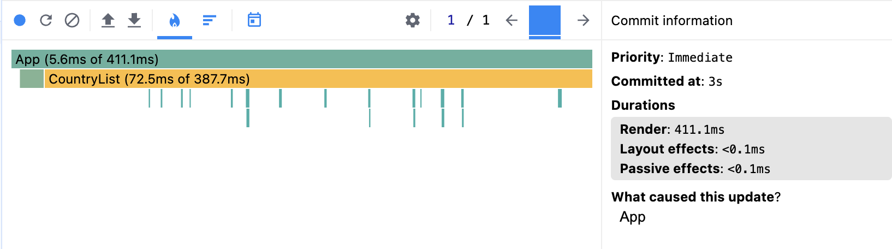
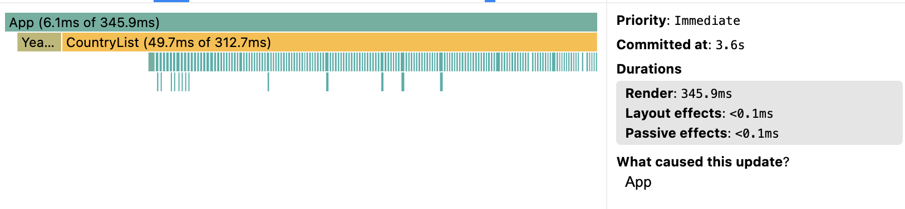
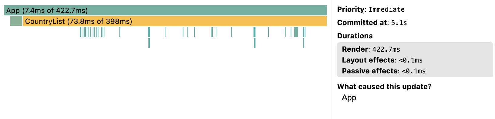
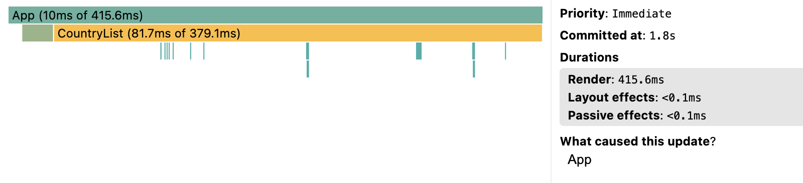
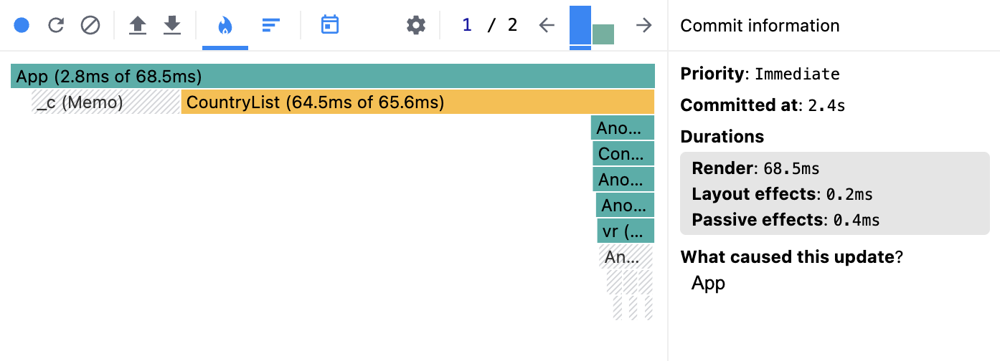
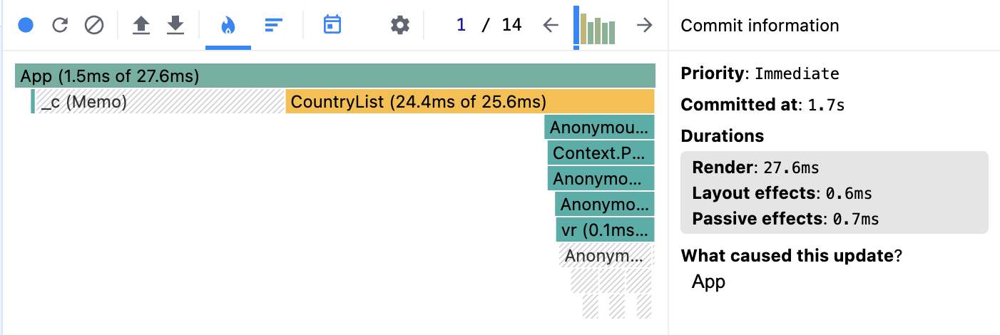
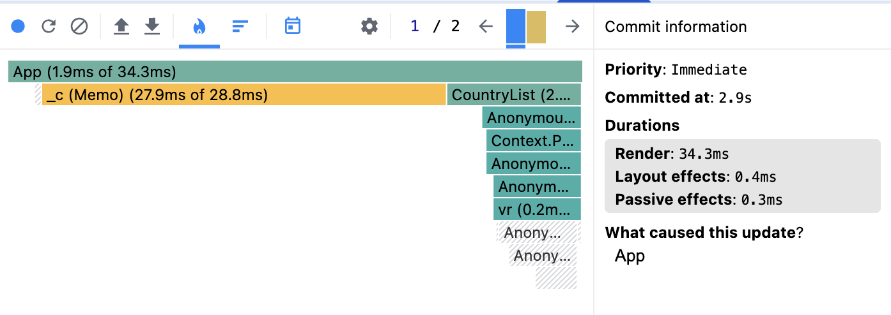
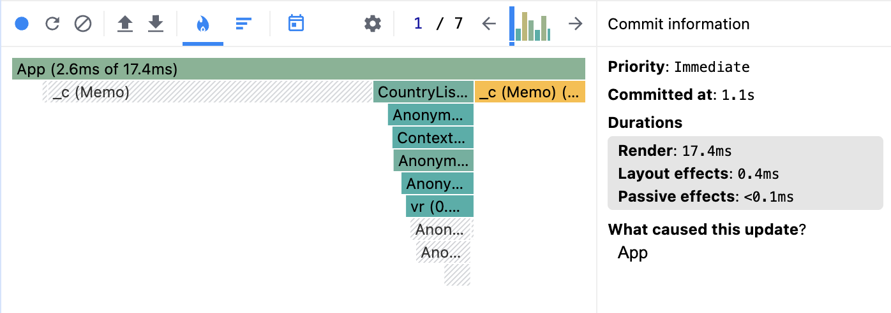

# Performance Optimization Report

## Baseline Measurements

### Interaction A: Sort countries

- **Commit duration**: 411.1 ms
- **Render duration**: 411.1 ms
- **Screenshot**: 

### Interaction B: Search countries

- **Commit duration**: 345.9 ms
- **Render duration**: 345.9 ms
- **Screenshot**: 

### Interaction C: Change year

- **Commit duration**: 422.7 ms
- **Render duration**: 422.7 ms
- **Screenshot**: 

### Interaction D: Toggle column

- **Commit duration**: 415.6 ms
- **Render duration**: 415.6 ms
- **Screenshot**: 

## Optimized Measurements

### Interaction A: Sort countries

- **Commit duration**: 68.5 ms
- **Render duration**: 68.5 ms
- **Screenshot**: 

### Interaction B: Search countries

- **Commit duration**: 27.6 ms
- **Render duration**: 27.6 ms
- **Screenshot**: 

### Interaction C: Select different year

- **Commit duration**: 34.3 ms
- **Render duration**: 34.3 ms
- **Screenshot**: 

### Interaction D: Toggle columns

- **Commit duration**: 17.4 ms
- **Render duration**: 17.4 ms
- **Screenshot**: 

## Summary of Improvements

| Interaction      | Baseline (ms) | Optimized (ms) | Improvement (%) |
| ---------------- | ------------- | -------------- | --------------- |
| Sort countries   | 411.1         | 68.5           | 83.3%           |
| Search countries | 345.9         | 27.6           | 92.0%           |
| Change year      | 422.7         | 34.3           | 91.9%           |
| Toggle columns   | 415.6         | 17.4           | 95.8%           |
| **Average**      | **398.8**     | **36.95**      | **90.7%**       |
